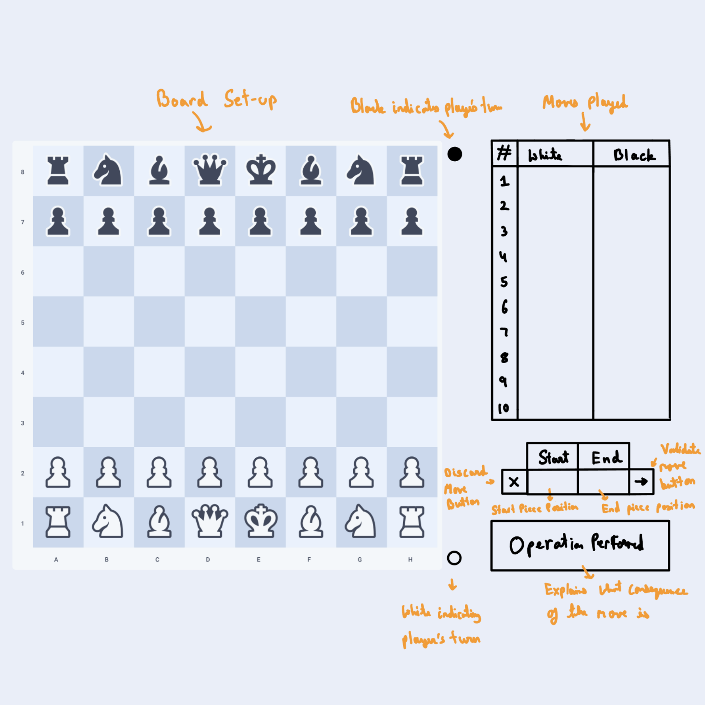

# CBL Chess Game

## Synopsis

A simple hot seat implementation of a 2 player chess game.

   
  <i>GUI Design Sketch</i>

## Backlog

*The items listed here are in the order of decreasing priority.*

  - [ ] Creating class structure: *(Learning Topic)* 
    - Note: Simple classes that accommodate our use case well.
  - [ ] Implement a grid:
    - Demo: Print the contents of the grid to the console.
    - Note: 2D array to console.
  - [ ] Pieces:
    - Demo: Print the contents of the grid to the console.
    - Note: The cells are objects, and will have variables storing the piece.
  - [ ] Show the grid and the Pieces:
    - Demo: Compare the pieces and grid displayed to the ones coded,
      and printed to the console.
    - Note: Display the background color of the grind and the pieces on top
      of that.
  - [ ] Show the grid labels:
    - Demo: Check if the grid labels are correctly displayed.
    - Note: On the side of the canvas.
  - [ ] Assign start positions:
    - Demo: The user interface displays the pieces as a regular starting
      position in chess would have them.
    - Note: Make sure the king and queen are in the right spots.
  - [ ] Move piece with from the terminal with positions, and update the piece
        position.
    - Demo: Enter a starting and ending location for any piece, and see if
      the UI is going to update it.
    - Note: Use the letter-number format usually used in chess.
  - [ ] Record what move have been played.
    - Demo: Do multiples moves from the terminal, and see if they are kept
      in an array correctly.
    - Note: Just display the list of moves after every move in the terminal.
  - [ ] Moving with clicking. *(Learning Topic)*
    - Demo: Click the piece that you want to move, then click on the square
      that you want it to move to.
    - Note: Also make the clicked cells highlighted.
  - [ ] Check who the next player is.
    - Demo: players can only play moves in an alternate fashion with white
      starting.
  - [ ] Validate the move.
    - Demo: Do not allow the piece to move if the move is incorrect.
    - Note: This requires that there is a function for each piece type that
      can determine if the piece can move there.
  - [ ] Add a box that displays the past moves.
    - Demo: Check if the rendered past moves are the same ones displayed in
      the terminal.
  - [ ] Add discard button. *(Learning Topic)*
    - Demo: Discard button discards the start and end position clicked while 
    - Note: Do not complete the move immediately, offer the option of
      discarding the move.
  - [ ] Add enter button. *(Learning Topic)*
    - Demo: Enter button performs and updates the positions accordingly
      otherwise doesn't do anything.
    - Note: Replace the mechanic of automatically completing the move.
  - [ ] Display the consequence of the move:
    - Demo: Performs the move and checks the results
    - Note: Check what kind of cell the piece is moving to.
  
> [!NOTE]
> If we have time, we may also implement special moves
> or we may do checking of checks and checkmate.
> 
> We will not implement any kind of chess solving algorithm.

## Learning

We want to learn to do the following things with this project:

  - Version control and project management with git.
  - Adopting common design patterns concerning class structure.
  - Graphical user input handling.

## Resources

  - [Creating a Game in Swing](https://peerdh.com/blogs/programming-insights/creating-a-game-loop-in-java-swing)
  - [Designing a Chess Game](https://www.geeksforgeeks.org/dsa/design-a-chess-game/)
  - [Drawing Images](https://reintech.io/blog/java-2d-graphics-drawing-shapes-text-images)
  - [Chess Assets](https://www.figma.com/community/file/971870797656870866)
